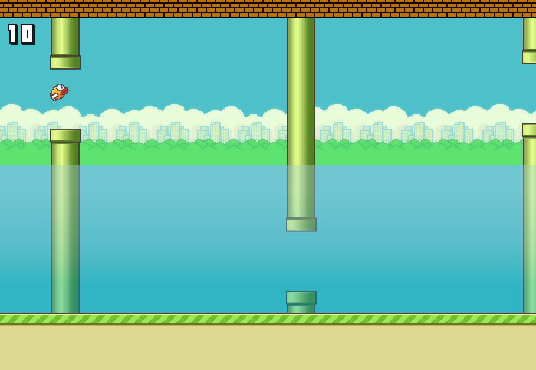

# Flappy bird fish
A flappy bird clone with a small twist. Build using [PixiJS](http://www.pixijs.com/).

Best played on Google Chrome or Firefox

## How to play
'flap' by using spacebar/mouseclick/touch. You can also use this to reduce your momentum when going too fast

## Where to play
Can be played on [https://boydbueno.github.io/flappy-fish/](https://boydbueno.github.io/flappy-fish/).

Or download the repo and run index.html through a webserver.

### Notice
I do not own the assets, nor do I have explicit permission to use them from their creator. They are the work and copyright of original creator Dong Nguyen and .GEARS games.

